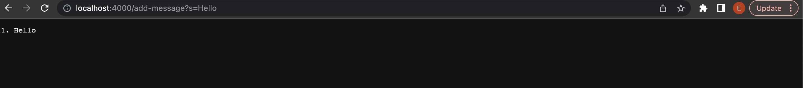
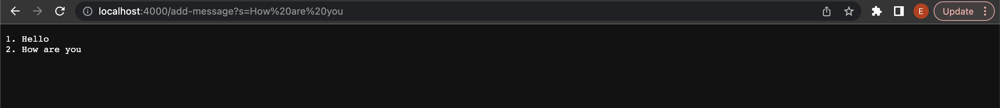

String Server Code

handleRequest of class Handler is called when a request to the server is made from the URL.

When /add-message is detected in the URL, the method splits the arguments given after ? to two different strings

When the first parameter is s, the second parameter which is `Hello` is used in the following code

` message[0] += sequenceNumber[0]++ + ". "  + parameters[1] + "\n" `

This will add to the String message the sequence number, which in this request is `1`, a `. `, the second parameter `Hello`, and ending it with a new line `\n`

SequenceNumber gets updated to 1, so the next request will give 2

handleRequest of class Handler is called when a request to the server is made from the URL.

When /add-message is detected in the URL, the method splits the arguments given after ? to two different strings

When the first parameter is s, the second parameter which is `How are you` is used in the following code

` message[0] += sequenceNumber[0]++ + ". "  + parameters[1] + "\n" `

This will add to the String `message` the sequence number, which in this request is `2`, a `. `, the second parameter `Hello`, and ending it with a new line `\n`

SequenceNumber gets updated to 2, so the next request will give 3
