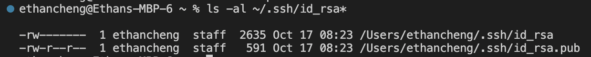

String Server Code

handleRequest of class Handler is called when a request to the server is made from the URL.

When /add-message is detected in the URL, the method splits the arguments given after `?` to two different strings

When the first parameter is s, the second parameter which is `Hello` is used in the following code

`message[0] += sequenceNumber[0]++ + ". "  + parameters[1] + "\n"`

This will add to the String message the sequence number, which in this request is `1`, a `. `, the second parameter `Hello`, and ending it with a new line `\n`

SequenceNumber gets updated to 1, so the next request will give 2

handleRequest of class Handler is called when a request to the server is made from the URL.

When /add-message is detected in the URL, the method splits the arguments given after `?` to two different strings

When the first parameter is s, the second parameter which is `How are you` is used in the following code

`message[0] += sequenceNumber[0]++ + ". "  + parameters[1] + "\n"`

This will add to the String `message` the sequence number, which in this request is `2`, a `. `, the second parameter `Hello`, and ending it with a new line `\n`

SequenceNumber gets updated to 2, so the next request will give 3

Private key path

Public key path

Login without password prompt

While I have create web servers on my home computer and macbook on a local host, from the Week 2 Lab, I learned how to connect to a remote server and connecting to that web server. Continuing from what I learned from week 2 Lab, week 3 Lab taught me how to set up SSH Keys for easy access. This allows me to connect to my remote server without having to enter a password everytime by giving the remote server a key to look for when I connect. I also learned how to use `scp` to safely copy files from my local computer to the remote server.
