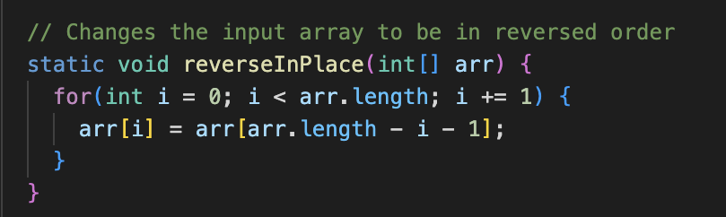
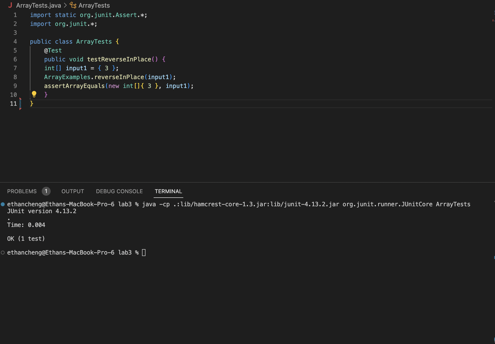
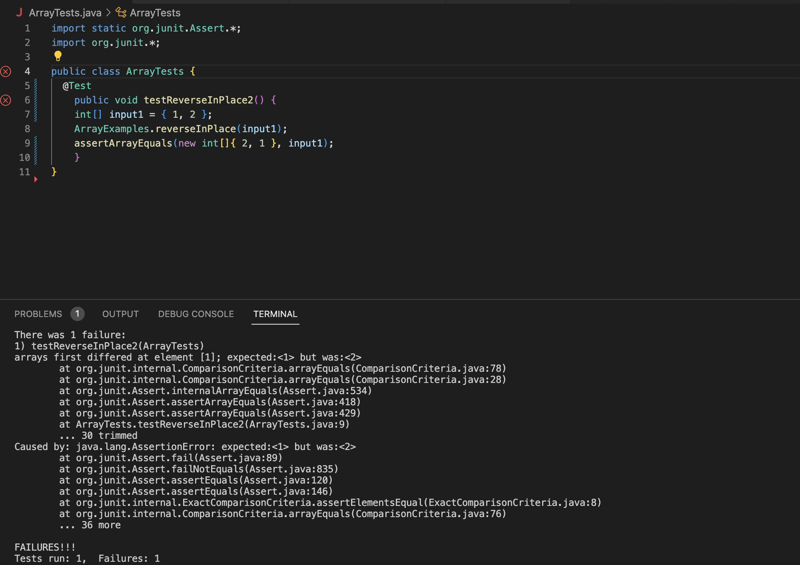

From Lab 4, reverseInPlace method of class ArrayExamples

A failure-inducing input for the buggy program

```
{
    @Test 
	public void testReverseInPlace2() {
        int[] input1 = { 1, 2 };
        ArrayExamples.reverseInPlace(input1);
        assertArrayEquals(new int[]{ 2, 1 }, input1);
	}
}
```

An input that doesn’t induce a failure

```
{
   	@Test 
	public void testReverseInPlace() {
        int[] input1 = { 3 };
        ArrayExamples.reverseInPlace(input1);
        assertArrayEquals(new int[]{ 3 }, input1);
	}
}
```

The symptom, as the output of running the tests



The bug, before-and-after code change required to fix it 

Before

```
{
    arr[i] = arr[arr.length() - i - 1];
}
```

After

```
        int left = 0;
        int right = arr.length - 1;

        while (left < right) {
            int temp = arr[left];
            arr[left] = arr[right];
            arr[right] = temp;
            left++;
            right--;
```

This two-pointer approach works by ensuring that every pair of elements symmetrically located with respect to the center of the array gets swapped.


Grep

-r: For each directory operand, read and process all files in that directory, recursively. Useful to search through all the files inside a directory, especially if you do not know which file has exactly what you are searching for.

```
grep -r "base-pairs"
```

```
./biomed/gb-2002-4-1-r1.txt: 9base-pairs (2.51 gigabases (Gb)), whereas MGSCv3 has about
```

```
grep -r "interpolation"
```

```
./government/Env_Prot_Agen/ctf7-10.txt:fitting, interpolation, etc.
```

-l: Print the name of each input file from which output would normally have been printed and stops upon first match. Useful when you only need to find the file name that has the pattern and not the exact instance of it.

```
grep -r -l "base-pairs"
```

```
./biomed/gb-2002-4-1-r1.txt
```

```
grep -r -l "interpolation"
```

```
./government/Env_Prot_Agen/ctf7-10.txt
```

-v: Invert to select non-matching lines. Useful when you know what pattern you don't want and need to find every other instance of it.

```
grep -r -v "base-pairs"
```

```
./911report/chapter-11.txt:            In the summer of 2001, DCI Tenet, the Counterterrorist Center, and the
./911report/chapter-11.txt:                Counterterrorism Security Group did their utmost to sound a loud alarm, its basis
./911report/chapter-11.txt:                being intelligence indicating that al Qaeda planned something big. But the
./911report/chapter-11.txt:                millennium phenomenon was not repeated. FBI field offices apparently saw no abnormal
./911report/chapter-11.txt:                terrorist activity, and headquarters was not shaking them up. Between May 2001 and
./911report/chapter-11.txt:                September 11, there was very little in newspapers or on television to heighten
./911report/chapter-11.txt:                anyone's concern about terrorism. Front-page stories touching on the subject dealt
./911report/chapter-11.txt:                with the windup of trials dealing with the East Africa embassy bombings and Ressam.
./911report/chapter-11.txt:                All this reportage looked backward, describing problems satisfactorily resolved.
./911report/chapter-11.txt:                Back-page notices told of tightened security at embassies and military installations
./911report/chapter-11.txt:                abroad and government cautions against travel to the Arabian Peninsula. All the rest
./911report/chapter-11.txt:                was secret.
./911report/chapter-11.txt:        
./911report/chapter-11.txt:    
```

```
grep -r -v "interpolation"
```

```
./911report/chapter-11.txt:            In the summer of 2001, DCI Tenet, the Counterterrorist Center, and the
./911report/chapter-11.txt:                Counterterrorism Security Group did their utmost to sound a loud alarm, its basis
./911report/chapter-11.txt:                being intelligence indicating that al Qaeda planned something big. But the
./911report/chapter-11.txt:                millennium phenomenon was not repeated. FBI field offices apparently saw no abnormal
./911report/chapter-11.txt:                terrorist activity, and headquarters was not shaking them up. Between May 2001 and
./911report/chapter-11.txt:                September 11, there was very little in newspapers or on television to heighten
./911report/chapter-11.txt:                anyone's concern about terrorism. Front-page stories touching on the subject dealt
./911report/chapter-11.txt:                with the windup of trials dealing with the East Africa embassy bombings and Ressam.
./911report/chapter-11.txt:                All this reportage looked backward, describing problems satisfactorily resolved.
./911report/chapter-11.txt:                Back-page notices told of tightened security at embassies and military installations
./911report/chapter-11.txt:                abroad and government cautions against travel to the Arabian Peninsula. All the rest
./911report/chapter-11.txt:                was secret.
./911report/chapter-11.txt:        
./911report/chapter-11.txt:    
```

-c: Print a count of matching lines for each input file. Useful when you need to know the count of the pattern in a file.

```
grep -r -l "base-pairs"
```

```
./biomed/gb-2003-4-9-r57.txt:1
```

```
grep -r -c "interpolation"
```

```
./911report/chapter-11.txt:0
```


[Source](https://www.gnu.org/software/grep/manual/grep.html#Command_002dline-Options)