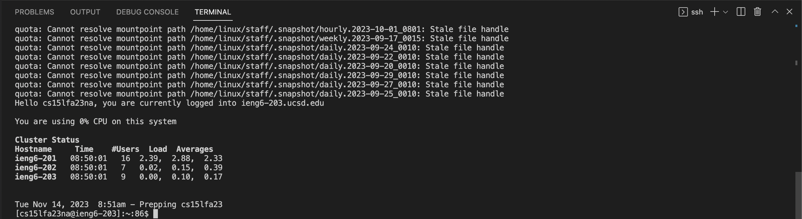
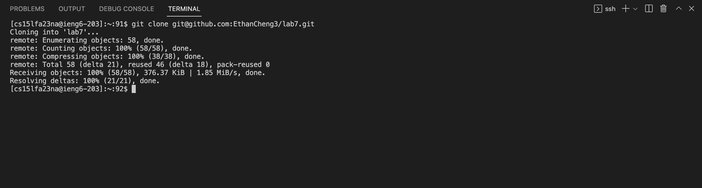
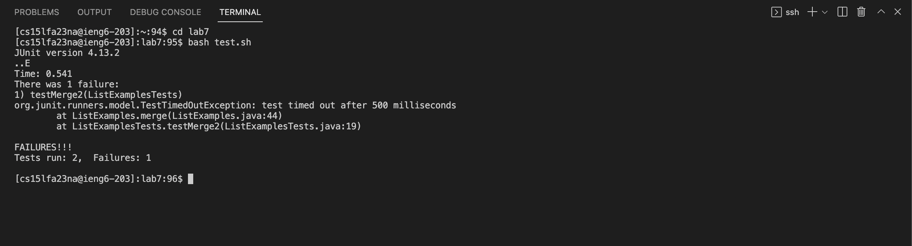
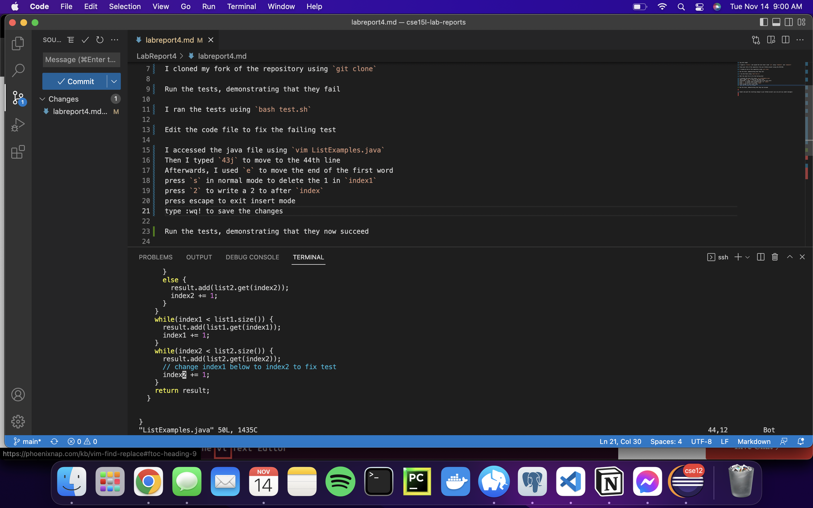
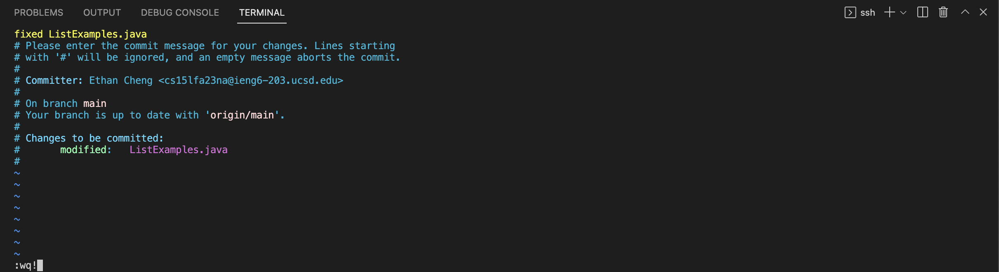
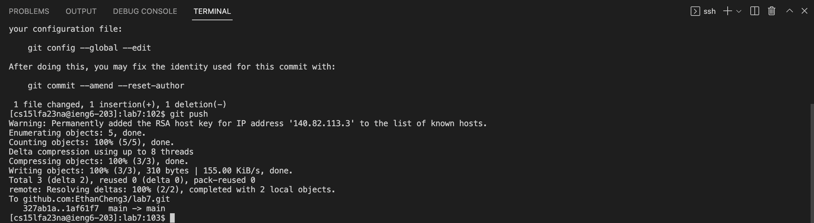

Log into ieng6 using `ssh cs15lfa23na@ieng6.ucsd.edu`

I typed in `history` and copied the last time I used `ssh` using `Command-C` and `Command-V`

Clone your fork of the repository from your Github account (using the SSH URL)

I cloned my fork of the repository using `git clone git@github.com:EthanCheng3/lab7.git`

Run the tests, demonstrating that they fail

I ran the tests using `bash test.sh`

Edit the code file to fix the failing test

I accessed the java file using `vim ListExamples.java`
Sequence of key presses
`43j e s backspace 2 esc :wq!`

Then I typed `43j` to move to the 44th line

Afterwards, I used `e` to move the end of the first word

press `s` in normal mode to delete the 1 in `index1`

press `2` to write a 2 to after `index`

press escape to exit insert mode

type :wq! to save the changes

Run the tests, demonstrating that they now succeed

I used the `<up>` to reuse the same command that I used before editting the file.

Commit and push the resulting change to your Github account (you can pick any commit message!)

Committed the changes using `git commit -a` (Didn't need to use git add since `-a` option with git commit stages all changes)

Pushed the changes to GitHub using `git push`