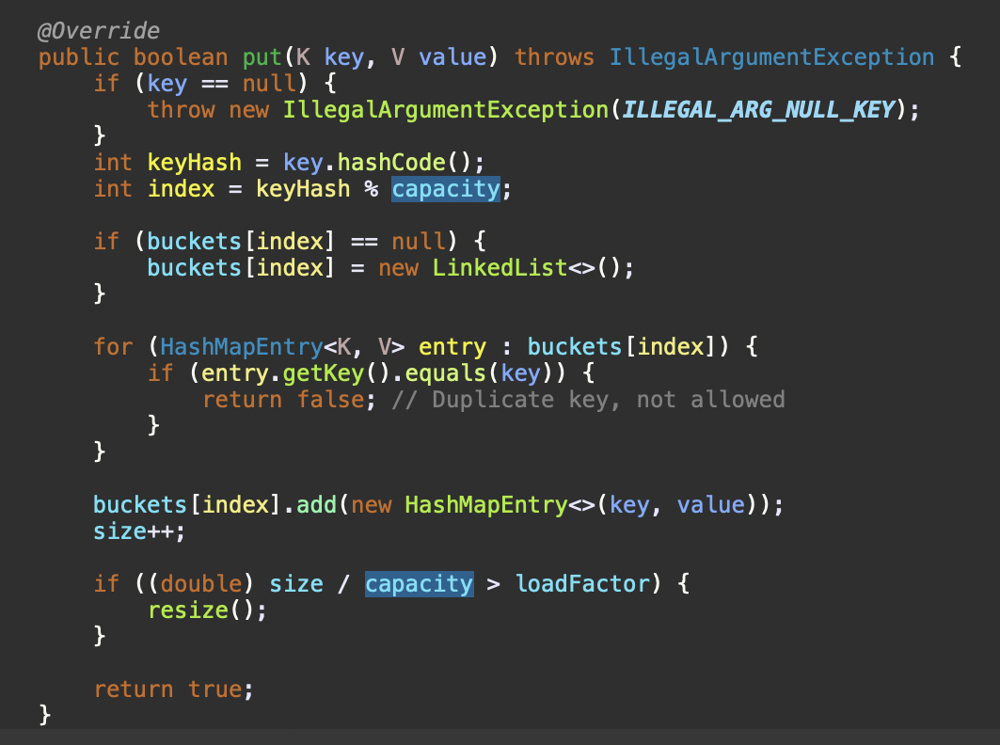
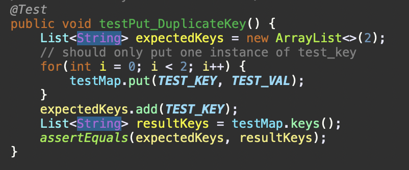
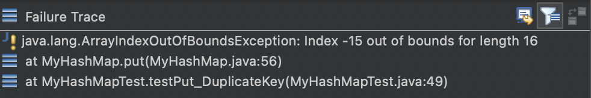
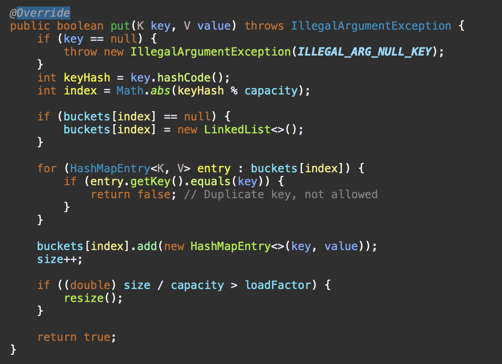

Hey! I have been struggling with this for a while now, when I run my bash script for my tests, I get this ArrayIndexOutOfBoundsException for my code. What I am doing in the test is adding the same key twice and checking that there is only one instance in it, but it is failing at the first iteration.

Hey there! Looking at your code, have you checked what key.hashCode() returns? You can use jdb to go through the iterations and check the value of each of your variables to see where it is throwing the exception

Thank you so much! I was able to fix the bug using jdb, key.hashCode() was returning a negative number so when I tried to get the index using `keyHash % capacity` it was returning a negative index. This is my fixed code and it is now passing my tests.

Reflection

During the second half of the quarter, we learned about Vim, a text editor that works through the command line. There are a plethora of shortcuts that I discovered to boost my efficiency and speed. Some of the ones I learned were:

1. **Navigation:**
    - **h, j, k, l:** Move the cursor left, down, up, and right respectively.
    - **w, b:** Jump forward or backward to the beginning of the next word.
2. **Editing:**
    - **i, I:** Enter insert mode before or at the beginning of the line.
    - **a, A:** Enter insert mode after or at the end of the line.
    - **o, O:** Open a new line below or above the current line and enter insert mode.
3. **Undo and Redo:**
    - **u:** Undo the last change.
    - **Ctrl + r:** Redo the undone change.
4. **Files and Buffers:**
    - **:q, :w, :q!:** Quit, save, and force quit without saving.
    - **:e filename:** Open a new file.
    - **:bnext, :bprev:** Switch to the next or previous buffer.
5. **Marks and Jumps:**
    - **m<letter>:** Set a mark at the current cursor position.
    - **'<letter>:** Jump to the line of the mark.
    - **Ctrl + o, Ctrl + i:** Jump backward or forward in the jump list.

There were a lot more that I have yet to use, but I feel like I can always improve the speed at which I use vim through these commands