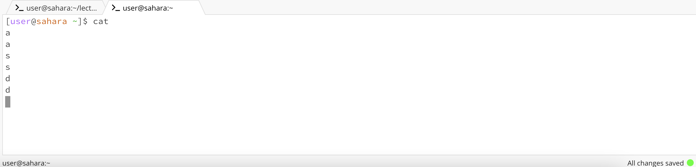

Example of the `cd` command in the lecture1 directory with no arguments

When cd is executed without arguments, the user is returned to the home directory.

This output is not an error.

Example of the `cd` command in the home directory with lecture1 as the argument

Changes the directory from the home directory to the lecture1 directory.

This output is not an error.

Example of the `cd` command in the messages directory with en-us.txt as the argument

Attempts to change directory to the file en-us.txt and throws an error due to it not being a directory.

This output is an error as there is no collection of files or directories inside a file.

Example of the `ls` command in the home directory with no argument

Example of the `ls` command in the lecture1 directory with messages as the argument

Example of the `ls` command in the messages directory with en-us.txt as the argument

Example of the `cat` command in the home directory with no argument

Example of the `cat` command in the home directory with lecture1 as the argument

Example of the `cat` command in the messages directory with en-us.txt as the argument
